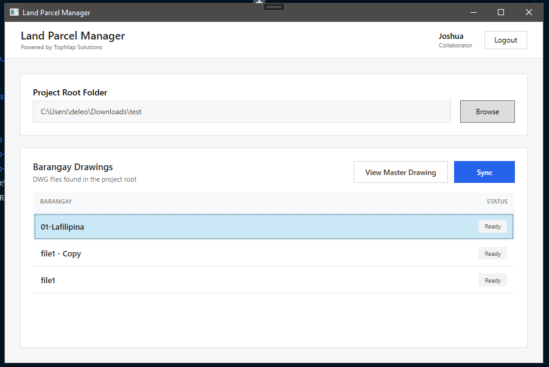

# AutoCAD Parcel Manager

A custom AutoCAD toolkit for surveyors working with multiple barangay drawings within a city project.

The goal is to provide native AutoCAD tools for managing, opening, synchronizing, and working with parcel and barangay drawings without forcing surveyors into a separate workflow.

Built with **C#**, **.NET**, and the **AutoCAD .NET API**.

This is primarily a **custom internal AutoCAD toolset** designed around the workflows of surveyors and GIS/CAD teams.

## Screenshot

