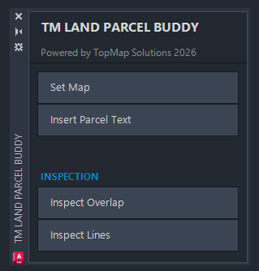
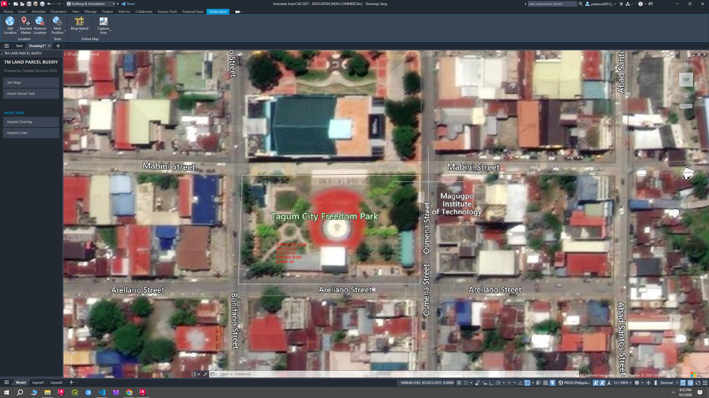

# AutoCAD Parcel Manager

A custom AutoCAD toolkit for surveyors and GIS/CAD teams working with parcel and barangay drawings. This makes the AUTOCAD as the primary source truth data since its constantly changing such as subdivision and other more.

Built with **C#**, **.NET**, and the **AutoCAD .NET API**.

The goal is to reduce repetitive manual work by providing native AutoCAD tools for **parcel management, map consistency, geolocation, and CAD file synchronization**.

# Roadmap

## 1. TM Land Parcel Buddy

A native AutoCAD plugin designed to support surveyors during parcel production.

### Screenshots

**Goals:**

* Improve map consistency
* Reduce manual geolocation work
* Improve workflow accuracy
* Provide surveyor-focused AutoCAD tools

## 2. Land Parcel Manager

A project-level file manager for managing barangay CAD drawings.

### Screenshots

**Goals:**

* Sync and download drawings
* Manage barangay files
* Check drawing versions
* View multiple barangays in a combined overview
* Identify alignment and positioning issues
* Upload it to the database both DXF and DWG ready to be sync

## Vision

Create a simple, native AutoCAD workflow where surveyors can **work with, manage, and validate parcel drawings without leaving AutoCAD**.
